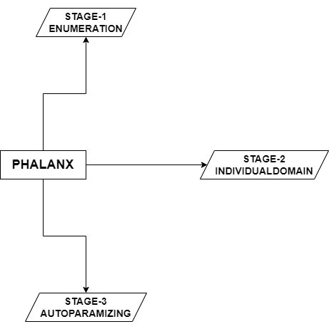
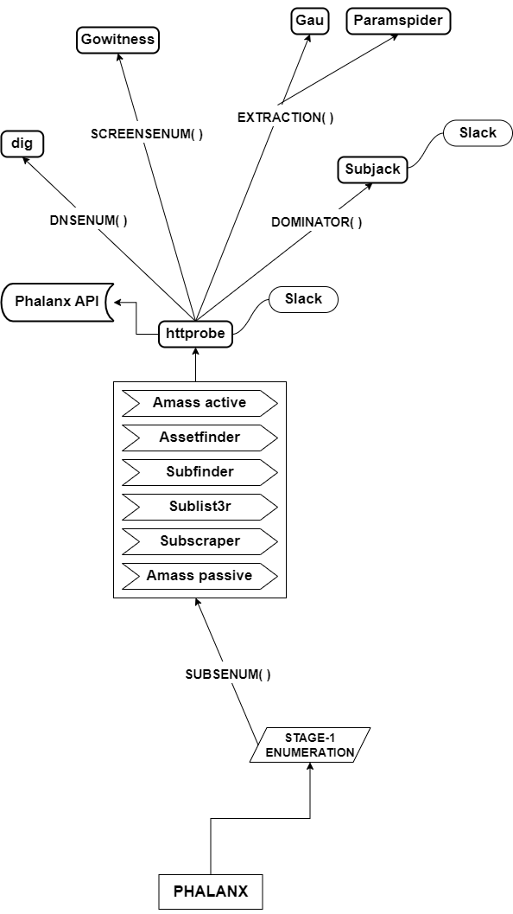
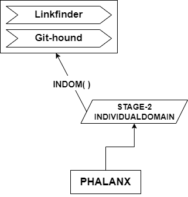
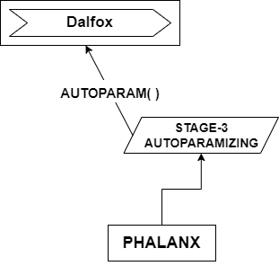

  
  <h3 align="center" style="color:#ff9000;">Automated weapon for penetration testers</h3>

  

    
    
  

# Diagram
## Stages

     
    
     
     

## STAGE-1

     
    
     
     

## STAGE-2

     
    
     
     

## STAGE-3

     
    
     
     

# Disclaimer
Phalanx has been in private development for a few years. While later versions are available, v1.5.3 is released as a public good for penetration testers. Review the code before adding it to your workflow, and use at your own risk.